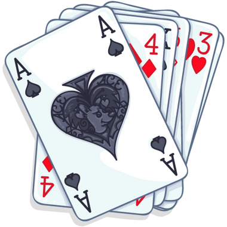

# The Coolest Shuffler



## Build

This project has only one dependency to run: **docker-compose**. For development purposes you may need to: 

- **Go 1.18** 
- **make**

To start you must run:
```sh
docker-compose up -d
```
To stop the app you must run:
```sh
docker-compose stop
```

## API
Create a new **Deck**:

```sh
curl -i -X GET "http://localhost:8916/the-coolest-shuffler/v1/deck/new"
```

Open a **Deck**:

```sh
curl -i -X GET "http://localhost:8916/the-coolest-shuffler/v1/deck/:id"
```

Draw a **Card**:

```sh
curl -i -X GET "http://localhost:8916/the-coolest-shuffler/v1/deck/:id/draw"
```

## Troubleshooting

Some [Makefile](Makefile) goals need to run global dependencies, if you have problems running _mockery_, please, try:

```sh
export GOPATH=$HOME/go
export PATH=$PATH:$GOPATH/bin
```

> HINT: your `go` installation path can be different.